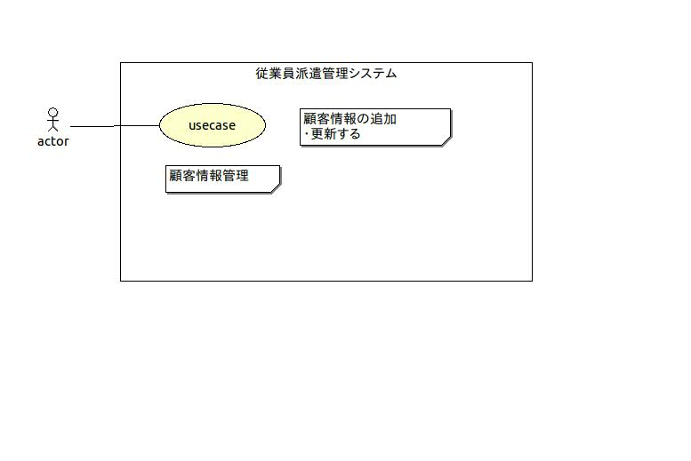

#顧客情報の管理

## 1.概要
従業員管理システムにおいて顧客情報の追加や更新ができるように
機能の追加や‥変更を行う

## 2.ユースケース図

## 3.イベントフロー
1. メインフロー
このユースケースは、オペレーターが「顧客管理」を選択することから
始まり、選択された機能コードにより、以下の処理に分かれる
	1.「追加」の機能コード(CI)が選択せれた場合
	オペレータが顧客情報を入力すると、システムは入力された顧客情報に
	顧客マスタに登録されている最大の顧客IDを加えた顧客IDを割り当てて
	顧客マスタに登録し、割り当てられた顧客IDを画面に表示する
	2.　「更新」の機能コード(CU)が選択された場合
	オペレータが顧客IDを指定すると、シスタム該当する顧客情報を顧客
	マスタから取り出して表示する。オペレータが更新する項目番号と更新値
	を入力すると、システムは入力された値で顧客マスタを更新する。

## 4.シーケンス図

## 5.クラス図

### 5.1.クラスの概要
|クラス名|概要|
|:-------|:---|
|SystemManager|従業員派遣管理メインクラス|
|Client|顧客マスタファイルのレコードをまとめたリストを表す|
|AddClientStatus|顧客管理の「追加」処理を行う|
|UpdateClientStatus|顧客管理のお「更新」を行う|
 
## 6.メソッド一覧

### 6.1 クラス SystemManager
|NO.|メソッド名|処理名|変更箇所|
|:--|:---------|:-----|:-------|
|1|main|メインメソッド|PersonList => ClientList|
|2|statusSetting|システム状態の設定|メインメニューに顧客管理を追加 
顧客情報の追加ステータスを生成 
顧客情報の更新ステータスを生成 

### 6.2 クラス AddClientStatus
|NO.|メソッド名|処理名|変更箇所|
|:--|:---------|:-----|:-------|
|1|displayFirsMess|最初に出力するメッセージの表示| |
|2|getNextStatus|
|3|displayFirstMess|最初に出力するメッセージの表示| |
|4|displayPromptMess|次の出力するメッセージの

### 6.3 クラス UpdateClientStatus
|NO.|メソッド名|処理名|変更箇所|
|:--|:---------|:-----|:-------|

### 7. ファイル
顧客管理からは顧客マスタ(client.csv)のみ追加/更新
- 顧客マスタ(client.csv)
	-顧客ID
	-会社名
	-住所
	-電話番号
	-削除フラグ

## 8. システム状態遷移図

## 9 画面イメージ
### 9.1 機能選択
### 9.2 顧客管理
#### 9.2.1 「追加」コードが選択された場合
#### 9.2.2 「更新」コードが選択された場合
